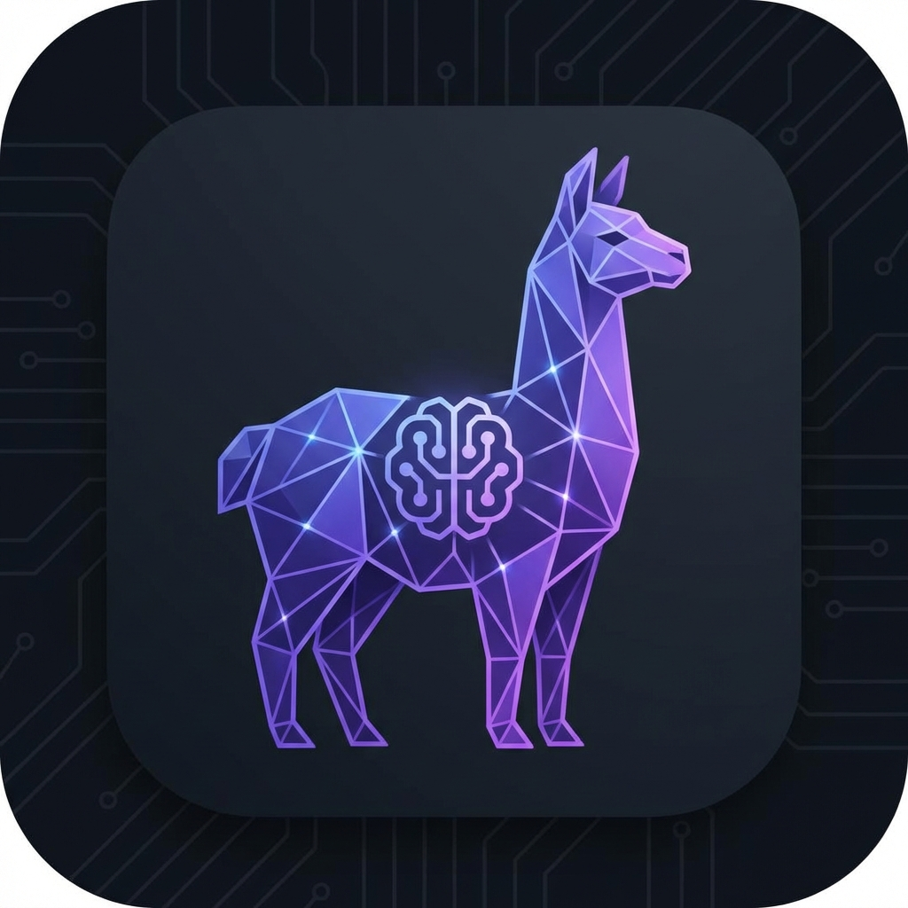

# AI Reasoning Agent

AI Reasoning Agent is a high-performance, deep-reasoning AI assistant designed for autonomous execution and persistent context. It integrates long-term vector memory, real-time tool-calling via the Model Context Protocol (MCP), and comprehensive experiment tracking.



## 🚀 Key Features

- **Deep Reasoning Core**: Optimized for models like **Qwen 2.5** and **Llama 3** with specialized "Execution Protocols" to prevent hallucinations.
- **Persistent Memory**: Integrated with **Qdrant Vector Database** for long-term document retrieval and conversation context.
- **Model Context Protocol (MCP)**: A centralized Python bridge providing the AI with real-time tools:
  - Real-time Market Prices (Gold, Bitcoin)
  - Currency Conversion (USD/IDR)
  - Web Search & Hardware/Network Discovery
  - Time, Date, and Weather tracking
- **Experiment Tracking**: Comprehensive logging of every interaction (inputs, outputs, and metadata) via **MLflow**.
- **Agentic Workflows**: Create and chain multiple AI agents into complex execution pipelines.
- **Modern UI**: A sleek, dark-mode prioritized interface built with React and Tailwind CSS.

## 🛠 Tech Stack

- **Frontend**: Vite, React, TypeScript, Tailwind CSS
- **Orchestration**: Python FastAPI (MCP Server)
- **Database**: 
  - **Qdrant**: Vector storage (Memory)
  - **SQLite**: Configuration & Tool Manifests
- **LLM Engine**: Ollama
- **Observability**: MLflow

---

## 🚦 Getting Started

### 1. Prerequisites
- [Ollama](https://ollama.com/) installed and running.
- [Docker & Docker Compose](https://www.docker.com/) installed.
- [Python 3.10+](https://www.python.org/) installed.

### 2. Infrastructure Setup
Spin up the supporting services (Qdrant & MLflow):
```bash
docker-compose up -d
```
- **Qdrant Dashboard**: [http://localhost:6333/dashboard](http://localhost:6333/dashboard)
- **MLflow UI**: [http://localhost:5001](http://localhost:5001)

### 3. MCP Server Setup
The MCP server manages tools and configuration.
```bash
cd mcp-servers
# Install dependencies (recommend using a venv)
pip install -r requirements.txt  # Or manually: fastapi uvicorn httpx mlflow sqlite3

# Run database migrations and seed the system prompt
python3 migrate.py
python3 seed_system_prompt.py

# Start the server
uvicorn mcp_server:app --reload --port 8000
```

### 4. Frontend Setup
```bash
npm install
npm run dev
```
Open [http://localhost:5173](http://localhost:5173) to start chatting.

---

## 🏗 Project Structure

- `src/`: React frontend application.
- `mcp-servers/`: Python middleware and tool definition logic.
  - `migrations/`: Versioned SQL schema and seed data.
  - `mcp_server.py`: Primary API gateway for tools and logging.
- `storage/`: Persistent data for Qdrant and MLflow.

## 📜 Execution Protocol
The AI is governed by a strict internal protocol that mandates:
1. **Tool Dominance**: Never answer factual data (prices, time, etc.) from memory.
2. **Zero Hallucination**: Hard-stop rules for missing data.
3. **Proactive Intuition**: Context-aware follow-ups after completing tasks.
